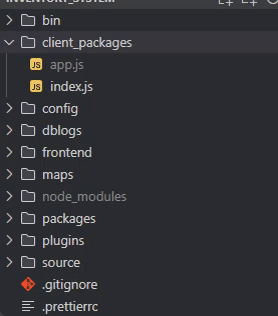
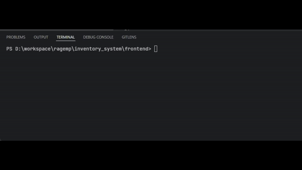

# RAGE Multiplayer Inventory System

## Class Structure

The `Inventory` class is the main class for managing player inventories in a game. It extends from other classes such as `InventoryClothes`, `QuickUse`, and `InventoryItem`.

- `InventoryBase`: Base class for inventory management. It initializes the inventory structure and handles basic operations.
- `InventoryItem`: Extends `InventoryBase` and adds methods for managing individual items in the inventory.
- `QuickUse`: Extends `InventoryItem` and adds methods for managing quick-use slots.
- `InventoryClothes`: Extends `QuickUse` and adds methods for managing clothing items in the inventory.

This class provides comprehensive functionality for managing player inventories, including adding, removing, equipping, and using items.

## Properties

- `items`: Contains the player's inventory items, divided into pockets and clothes.
- `quickUse`: Contains items assigned to quick-use slots.
- `weight`: Represents the total weight capacity of the inventory.
- `equippedWeapons`: Keeps track of equipped weapons.

## Constructor

- Initializes the inventory with player-specific data such as clothes, pockets, and quick-use items.

## Methods

- `addItem`: Adds an item to the inventory's pockets.
- `addClothingItem`: Adds a clothing item to the inventory.
- `removeClothes`: Removes a clothing item from the player's character.
- `loadClothes`: Loads clothing items onto the player's character.
- `setClothes`: Sets clothing items on the player's character.
- `reloadClothes`: Reloads clothing items onto the player's character.
- `getFreeSlot`: Retrieves a free slot in the inventory pockets.
- `getTotalFreeSlots`: Counts the total number of free slots in the inventory.
- `getClothingIndex`: Retrieves the index of a specific clothing item type.
- `resetItemData`, `resetClothingItemData`, `resetBackpackItemData`: Resets item data in the inventory.
- `updateOnScreenPed`: Updates the player's character appearance on-screen.
- `getItemModel`: Retrieves the model hash of an item type.
- `getItemAndStack`, `getItemsByHashName`, `getItemsInCategoryByHashName`, `getItemsByHashNameEx`: Methods for retrieving items by their type or category.
- `getItemByUUID`: Retrieves an item by its UUID.
- `hasPistolItem`, `hasShotgun`, `hasAssault`, `hasSMG`, `hasWeaponInFastSlot`: Methods for checking if the inventory contains specific weapon types.
- `getActualWeight`, `getWeight`, `getItemsWeight`: Methods for calculating the weight of the inventory and its items.
- `checkWeight`: Checks if adding a new item will exceed the weight limit.
- `getFreeSlotCount`: Retrieves the count of free slots in the inventory.
- `dropItem`, `splitStack`, `addPlayerItem`, `addPlayerItemEx`, `addMultipleItems`, `addCountToPlayerItem`, `manageFastSlots`, `pickupItem`, `moveItem`, `openItem`, `useItem`: Methods for managing inventory actions such as dropping, splitting, adding, and using items.
- `deleteItemStack`, `deleteItem`: Methods for deleting items from the inventory.
- `checkQuickUse`: Checks if an item is in a quick-use slot.
- `startUsingItem`: Initiates the usage of an item with a specified description and duration.

# Getting Started with UI

**Creating package2 folder:** 
 
**Building Inventory UI:** 
 
**Moving built files to package2:** 
 
